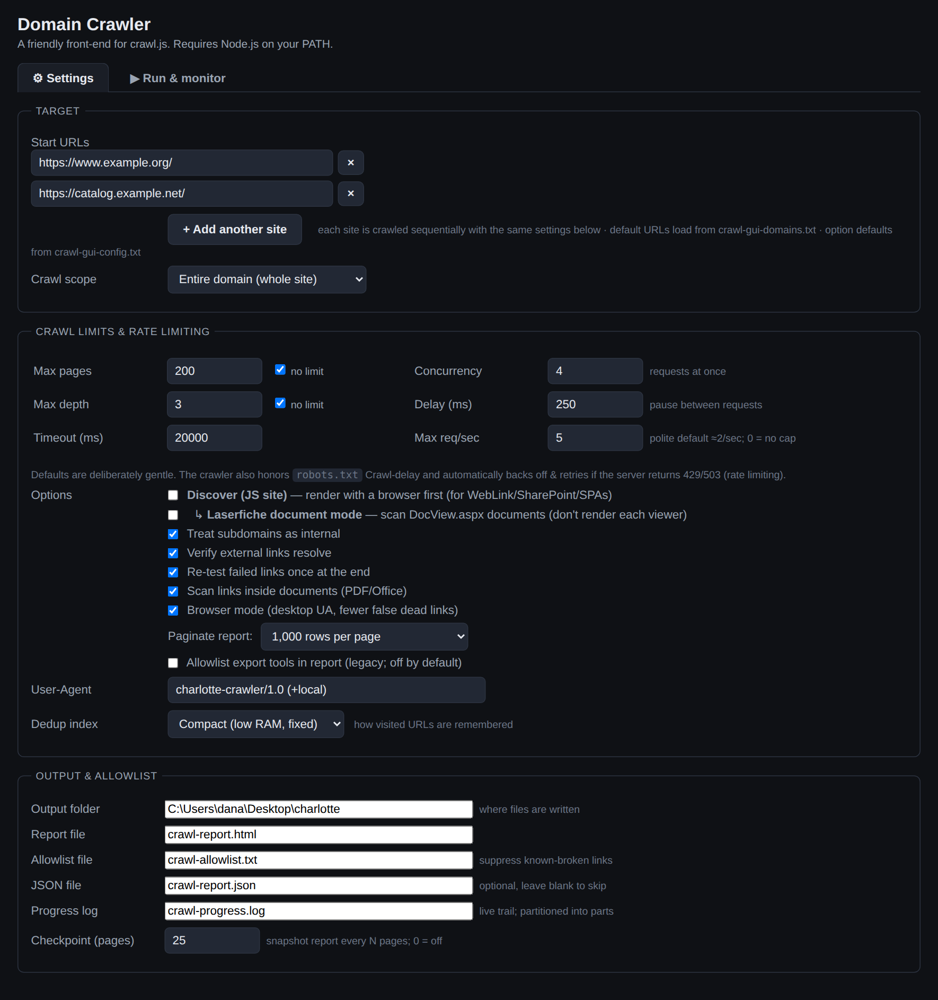
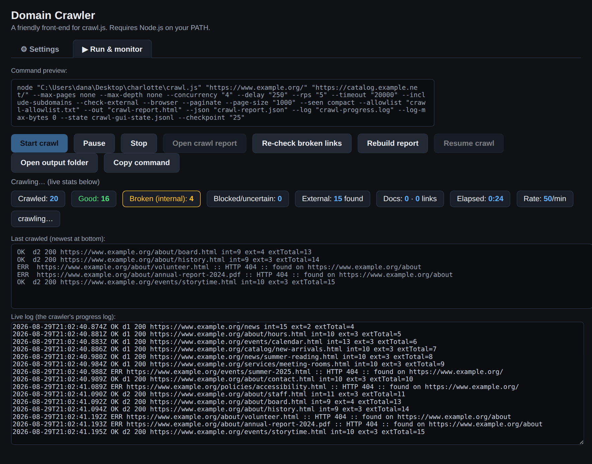
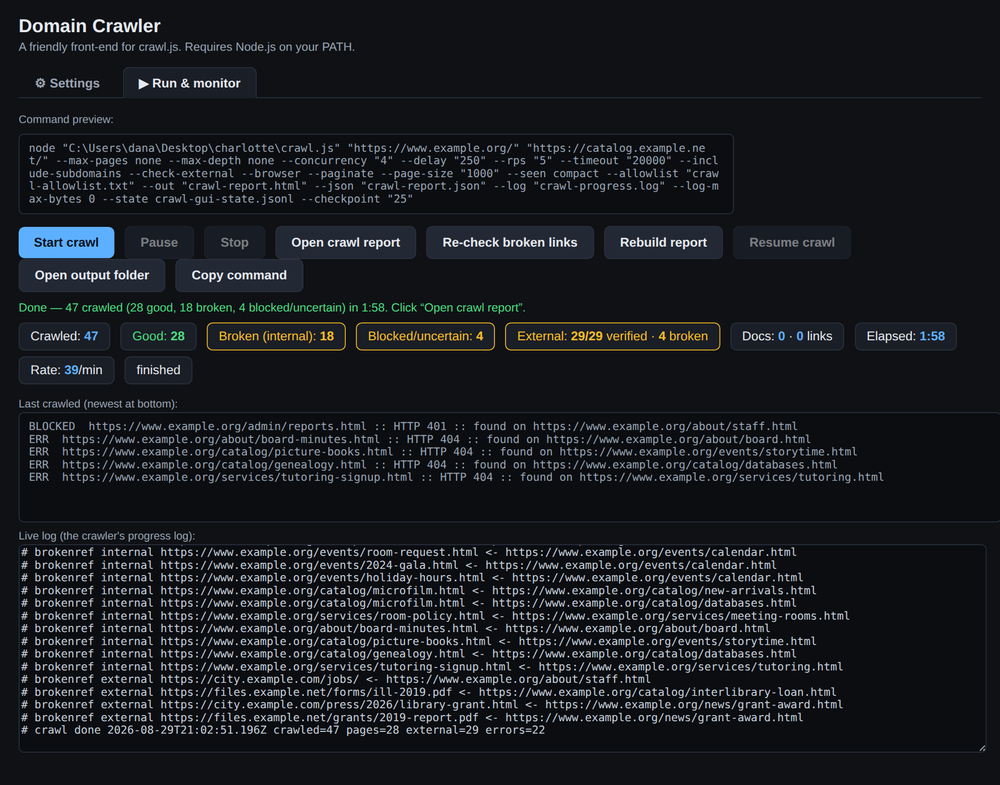

## `crawl-gui.hta` — Windows GUI

A friendly point-and-click front-end for `crawl.js`, for when you'd rather fill
in a form than type a command. It's a Windows HTML Application — it runs on
`mshta.exe`, which ships with every version of Windows, so there's **nothing to
install** beyond Node.js.



*The **Settings** tab — everything `crawl.js` can be told, as a form. Two start URLs are
loaded here (they're crawled one after the other with the same settings), scope is the whole
domain, pages and depth are unlimited, and the rate-limiting trio sits on the right. Every
field maps to exactly one flag, and the two optional files described below
(`crawl-gui-domains.txt`, `crawl-gui-config.txt`) just pre-fill it.*

### Requirements

- Windows.
- **Node.js on your PATH** (https://nodejs.org). The GUI just runs `crawl.js`
  for you; it doesn't replace Node.
- `crawl.js` **and its sibling modules** (`cli.js`, `netutil.js`, `recheck.js`,
  `report.js`, `parse.js`, `fetch.js`, `log.js`, `seen.js`) in the **same folder**
  as `crawl-gui.hta` (`crawl.js` is auto-detected and `require`s them).

### Default start URLs (optional)

To have the GUI open with sites already filled in, put a **`crawl-gui-domains.txt`**
next to `crawl-gui.hta` — **one URL per line**. Every line becomes its own Start-URL
row, so you can preload **as many domains as you like** (they're crawled sequentially
with the same settings). Blank lines and lines starting with `#` are ignored, and an
inline ` # comment` after a URL is trimmed:

```
# Sites I scan regularly
https://example.com/
https://docs.example.com/
https://blog.example.com/   # quarterly check
```

With no such file, the GUI opens with one empty row as before. A ready-to-edit
**`crawl-gui-domains.txt.example`** ships alongside — rename it (drop `.example`) and
fill in your sites.

### Default options (optional)

To open the GUI with your **preferred settings** (not just the built-in defaults), put a
**`crawl-gui-config.txt`** next to `crawl-gui.hta` — one **`key = value`** per line, where
the key is a form field's id. Checkboxes take `true`/`false`; `#` starts a comment; unknown
keys are skipped. It's read on launch and overrides that field's default:

```
concurrency  = 4
rps          = 5
checkExternal = false
noPages      = true        # crawl every page
pageSize     = 1000        # report pagination breakpoint: off / 250 / 500 / 1000 / 2500 / 5000
```

Keys mirror the form: `maxPages`, `maxDepth`, `concurrency`, `delay`, `rps`, `timeout`,
`checkpoint`, `userAgent`, `pathPrefix`, `allowlist`, `out`, `json`, `log`, `workDir`,
`scope` (domain/path/custom), `seen` (memory/compact/disk), `pageSize` (report pagination
breakpoint, or `off`), and the toggles `noPages`, `noDepth`, `includeSub`, `checkExternal`,
`recheck`, `scanDocs`, `browser`.
A documented **`crawl-gui-config.txt.example`** ships alongside. (Report **pagination
defaults to 1,000 rows/page** in the GUI; set `pageSize = off` here to render every row at
once, or to another breakpoint like `pageSize = 500`.)

### Use it

1. Double-click `crawl-gui.hta`.
2. Enter the start URL and adjust any options — **crawl scope** (whole domain,
   the start URL's subsection, or a custom path prefix), pages and depth (each
   with a **no limit** checkbox), the three rate-limiting knobs (concurrency /
   delay / max req-sec), subdomain and external-check toggles, User-Agent,
   **dedup index** (in-memory / compact / disk), output folder, report name,
   allowlist, optional JSON, progress-log name, and **checkpoint** interval.
3. Watch the live command preview update as you type.
4. Click **Start crawl**. A live stats bar shows **crawled / good / broken**
   counts, **external links** (found, then verified X/Y during the external-check
   phase), **elapsed** time, and **rate** per minute, with a rolling view of the
   **last 5** URLs so you can see at a glance whether it's progressing or stuck
   (it flags rate-limit backoff and when no new page has appeared for a while).
   The live log streams below, and **Open report** lights up when it finishes.

   The GUI's defaults are: whole-domain, **unlimited** pages and depth, subdomains
   treated as internal, and external-link verification on — adjust any of these
   before starting.

5. **Pause** suspends the crawl (click **Resume** to continue); **Stop** ends it
   gracefully and writes a partial report you can still open.



*The **Run & monitor** tab mid-crawl. At the top, the exact `node crawl.js …` command the form
builds (it updates as you type, and **Copy command** puts it on your clipboard). Below it the
live stats bar — **crawled / good / broken / blocked**, external links, documents scanned,
elapsed and rate — then the rolling **last 5 URLs** so you can see at a glance whether it's
moving, and the crawler's own progress log streaming underneath.*



*The same tab when it finishes: a one-line summary, the stat bar frozen on the final numbers,
and **Open crawl report** lit up. **Re-check broken links** and **Rebuild report** re-run just
those phases against the crawl you already have; **Resume crawl** picks up an interrupted one.*

The GUI tails the crawler's own progress log for the live view, and uses a
single-file log for that run (log partitioning is a CLI feature — see below).
Broken links in the live log and the report show **which page they were found
on**.

Other buttons: **Open output folder** (jumps to where files were written) and
**Copy command** (puts the exact `node crawl.js …` line on your clipboard, in
case you want to script it later).

Everything the GUI sets maps directly to a `crawl.js` flag documented above, so
the [Rate limiting](CRAWLER_part_02_crawljs-node-crawler-recommended.md#rate-limiting) and [Allowlist](CRAWLER_part_02_crawljs-node-crawler-recommended.md#allowlist-stop-known-broken-links-from-cluttering-future-reports)
sections apply unchanged.

> If Windows shows a security prompt when opening the `.hta`, that's the normal
> warning for any local HTML Application — it runs with your user permissions.
> Only open `.hta` files you trust.

**Troubleshooting.** On locked-down/managed machines, security software may block
the GUI from launching a child process. If Start crawl reports it couldn't write
helper files or launch the crawl, the reliable fallback is **Copy command** →
paste it into a terminal (Command Prompt or PowerShell) and run it there. Running
`node` directly from a terminal is normally allowed even when scripts launched by
an `.hta` are not. (The GUI writes its small `crawl-gui-run.bat`/`.log` helpers
into the output folder, not `%TEMP%`, since `%TEMP%` is a common block target.)

---
