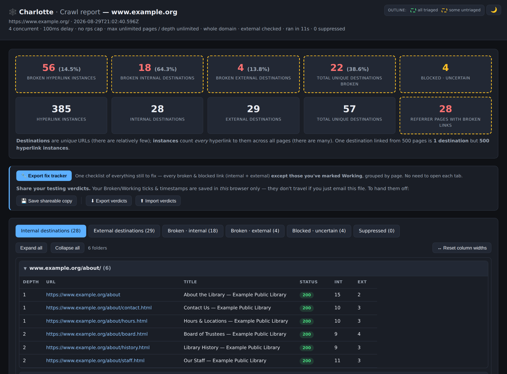
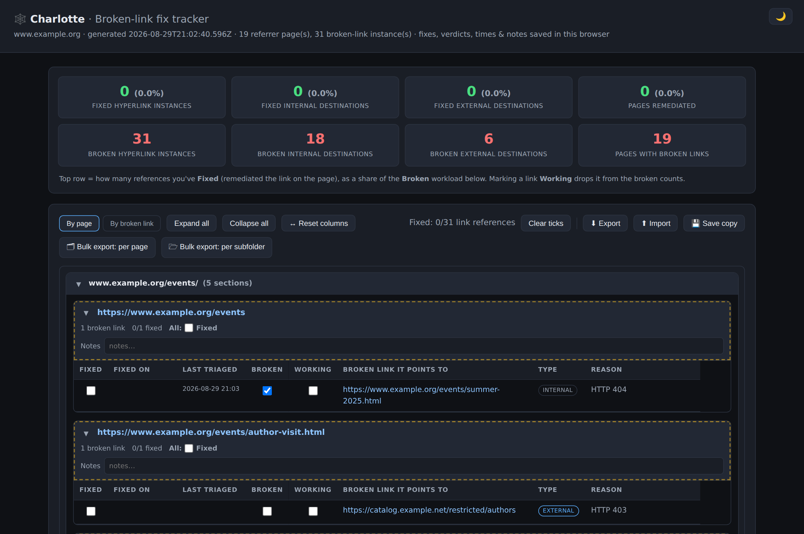

# Charlotte — Domain Crawler

Charlotte maps a single website: every internal link, plus a record of the
first-tier external links it points to. It verifies links (including links found
inside PDFs and Office documents) and writes a self-contained HTML report you
open in a browser.

The core crawler has **no install step to run** — the shipped `crawl.js` is a single
self-contained file that uses Node built-in modules only. (It is *built* from small
modules in [`src/`](src/) via an esbuild roll-up; the build tool is a dev-time
`devDependency`, never needed to run a shipped `crawl.js`. See "Building from source".)

## Which tool do I use?

| File | Runtime | Use it when |
|------|---------|-------------|
| [`crawl.js`](CRAWLER/CRAWLER_part_02_crawljs-node-crawler-recommended.md) | Node | Mapping any domain from your machine. No CORS limits. **Start here.** |
| [`crawl-gui.hta`](CRAWLER/CRAWLER_part_03_crawl-guihta-windows-gui.md) | Windows | You'd rather click than type — a form front-end for `crawl.js`. |
| [`crawl-render.js`](CRAWLER/CRAWLER_part_02_crawljs-node-crawler-recommended.md) | Node + Playwright | Two jobs in real Chromium: **re-check** links `crawl.js` flagged dead/blocked, and **`--discover`** a JavaScript-built site (an SPA like Laserfiche WebLink) that `crawl.js` can't navigate, emitting the links it finds back to `crawl.js`. |
| [`web-crawler.html`](CRAWLER/CRAWLER_part_04_web-crawlerhtml-in-browser-crawler.md) | Browser | You want a live, interactive report in the page, with no Node install. |
| [`local-cors-proxy.js`](CRAWLER/CRAWLER_part_05_local-cors-proxyjs-proxy-for-the-html-ve.md) | Node | Lets `web-crawler.html` crawl across domains from a `file://` page. |

## What it looks like



**The report** — one self-contained HTML file. Headline counts on top, then tabs for
everything crawled, the off-site links, and the broken/blocked ones. The two verdict boxes on
each broken row (**Broken** / **Working**) let you triage false positives away, and the
headline numbers drop as you do.



**The fix tracker** — one click from the report. A standalone checklist of every link still to
fix, grouped by the page it's on (or by the broken link), with Fixed boxes, timestamps and
per-page notes, and a dashboard of how much of the work is done. Bulk-export it into one
mini-tracker per page or per site section, hand those to the people who own those pages, and
import their progress back.


**The Windows GUI** (`crawl-gui.hta`) — the same crawler as a form, with a live command
preview, live stats while it runs, and Pause/Stop. Nothing to install beyond Node.

More screenshots — the triage tabs, the live run monitor, the tracker's views and the
sub-trackers — are in the [full reference](CRAWLER.full.md).


## Quick start

```bash
node crawl.js https://example.com/
# then open crawl-report.html
```

Bigger crawl, polite rate limit, verify external links resolve:

```bash
node crawl.js https://example.com/ --max-pages 500 --rps 5 --check-external
```

### Crawling a JavaScript-rendered site (SPA)

`crawl.js` reads only static HTML — it never runs JavaScript. A site that builds
its navigation client-side (Laserfiche WebLink, SharePoint, many document
portals) hands it an almost-empty shell, so it stalls after the handful of
static links and never reaches the documents. `crawl-render.js --discover` is the
fix: it renders each page in real Chromium, waits for the JS to settle, harvests
the links from the live DOM, recurses the folder tree, and writes the URLs it
finds to a seeds file — which you hand back to `crawl.js`:

```bash
# 1) render the site and harvest its real links into a seeds file
node crawl-render.js --discover https://site/folder/ --seeds seeds.txt

# 2) verify those links + scan the documents, in one report
node crawl.js --seeds seeds.txt --max-depth 0 --check-external
```

Confine it with `--scope path` / `--max-depth` / `--max-pages`, and on an
IIS/ASP.NET site (WebLink, SharePoint) add `--ignore-case` so `/Browse.aspx`
and `/browse.aspx` aren't crawled as two pages; `node crawl-render.js --help`
lists every option. (Needs Playwright — see `crawl-render.js` under
Requirements.) If a `crawl-gui-config.txt` is present (the Windows GUI's options
file), discover reads the **same** limits from it — max-pages/-depth, scope,
delay, etc. — so it honors what you set for a GUI crawl; `--no-config` opts out.

**Laserfiche WebLink** serves each document as a `DocView.aspx?id=N` *viewer
page*, not a file — so without help, discover renders every one (thousands of
wasted renders) and `crawl.js` only ever sees viewer HTML, never the document.
Add `--laserfiche`: discover then treats `DocView.aspx?id=N` as a document,
recording its file-download URL — by default `ElectronicFile.aspx?docid=N` (the
native electronic file; override with `--laserfiche-dl openpdf=true` for image
docs) — so `crawl.js` fetches the real PDF/Office bytes and scans the links
**inside** them, and skips rendering the viewer pages entirely. (In the GUI it's
the on-by-default **Laserfiche document mode** box.)

On Windows, the GUI (`crawl-gui.hta`) has a **Discover (JS site)** checkbox — on
by default — that runs this whole pipeline (render → harvest → verify + scan)
from the form's settings, with the live progress feed and Stop/Pause buttons
covering the render phase. Uncheck it for a plain static crawl.

See **[CRAWLER.full.md](CRAWLER.full.md)** for the complete reference: every
option, common workflows, the Windows GUI, the headless-render verifier, and
the in-browser variant. (It's the merged roll-up of a section graph
partitioned under `CRAWLER/`, indexed at
[`CRAWLER/CRAWLER_index.md`](CRAWLER/CRAWLER_index.md); [`CRAWLER.md`](CRAWLER.md)
is a pointer to the index.)

## Requirements

- **`crawl.js`, `local-cors-proxy.js`** — Node ≥ 14, zero npm dependencies to **run**.
  `crawl.js` ships as a **single self-contained file** (an esbuild roll-up of the modules in
  [`src/`](src/)); just run it. `local-cors-proxy.js` is a standalone zero-dep file.

## Building from source

Edit the small modules in `src/` (the source of truth), then regenerate the shipped
single-file `crawl.js`:

```bash
npm install   # dev-only: installs esbuild (a devDependency)
npm run build # rolls src/ up into ./crawl.js
```

The built `crawl.js` runs with **zero install** (Node built-ins only) — the build tool is
never needed to *run* it, only to rebuild it after a source change. `crawl-render.js` and
`local-cors-proxy.js` are standalone single files with no build step.
- **`crawl-render.js`** — Node, plus an optional [Playwright](https://playwright.dev)
  install (`npm install`); without it, run with `--http-fallback` for plain HTTP checks.
- **`crawl-gui.hta`** — Windows (mshta.exe) with Node on `PATH`.
- **`web-crawler.html`** — any modern browser.

## License

[MIT](LICENSE)
